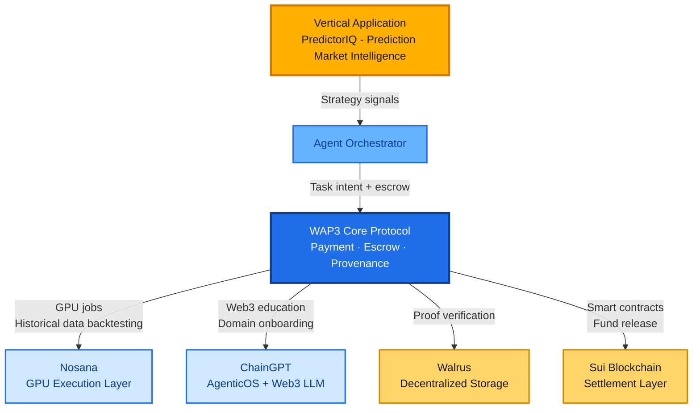

# WAP3 — Agent Payment & Provenance Layer

**Programmable settlement, verifiable execution, and provenance for autonomous agents.**

WAP3 is the infrastructure layer that enables AI agents to coordinate, transact, and record trustable execution histories across Web3 ecosystems. This repository contains the core protocol, smart contracts, and demo tooling.

---

## 🚀 Quick Start - Run the Demo

**One command to see it in action:**

```bash
./demo/run_mvp_demo.sh
```

**Expected output:**
```
MVP:AP2_INTENT_ID=0x...
MVP:X402_PAYMENT_ID=0x...
MVP:ESCROW_ID=0
MVP:PROOF_HASH=0x...
MVP:SETTLE_TX=0x...
MVP:AUDIT_JSON=demo/out/session_*/audit.json
```

**What it demonstrates:**
- ✅ AP2 Intent creation (Google AP2, 2025 Q3)
- ✅ X402 Payment trigger (Coinbase X402, 2025 Q2)
- ✅ On-chain escrow creation
- ✅ Autonomous agent task execution
- ✅ Proof submission and verification
- ✅ Automatic payment settlement
- ✅ Complete audit trail export

**Note:** Demo defaults to skip compilation for reliability and will automatically compile if supported by your environment.

---

## 📖 Documentation

- **[Demo Guide](demo/README.md)** - Detailed demo instructions and architecture
- **[Technical Documentation](TECHNICAL.md)** - Smart contract API and design
- **[Adapters](adapters/)** - Framework integration examples (LangGraph, Tool-Agent)

---

## Project Overview

WAP3 is a foundational protocol, not a single vertical application. It provides a reusable substrate for agentic systems that need micro-payments, proof-based verification, and auditable coordination.

**Layering model:**
- **Infrastructure layer (WAP3):** agent payments, escrow, and provenance
- **Intelligence layer (vertical apps):** domain-specific logic built on top of WAP3
- **Presentation layer (optional):** human-readable reports or briefings generated from intelligence outputs

---

## Vertical Application: PredictorIQ

PredictorIQ is a vertical intelligence application built on WAP3. It treats prediction markets as a distributed sensing layer and extracts **structured risk signals** rather than trading recommendations.

**Core ideas:**
- **Price quality:** whether market prices contain meaningful information or noise
- **Wallet quality:** who is driving the market and their historical accuracy
- **Signal synthesis:** explainable risk indicators with confidence metrics

PredictorIQ is one example of how WAP3 can power domain-specific intelligence products while keeping the infrastructure reusable for other verticals.

---

## About Us

### **GIOROX AI, INC.**

GioroX AI, Inc. is building the programmable financial layer for the Agent Economy. Our focus is enabling autonomous agents to transact, verify, and collaborate securely without human intervention.

---

## Our Vision

The future of AI is autonomous, and autonomy requires economic independence.

Traditional payment systems were designed for humans and fail to meet the requirements of AI-to-AI commerce:

- ❌ Too slow (days vs. milliseconds)
- ❌ Too expensive for micro-transactions ($0.30 + 2.9% per transaction)
- ❌ Require human authentication
- ❌ No cryptographic proof of work completion
- ❌ Centralized intermediaries

**WAP3 provides:**

- ✅ **Programmable escrow** on-chain with smart contract automation
- ✅ **Proof-based verification** via decentralized storage (Walrus, IPFS)
- ✅ **Sub-second settlement** with micro-payment support
- ✅ **Multi-chain support** across EVM, Move, and other ecosystems
- ✅ **Full provenance** with immutable on-chain audit trails
- ✅ **Zero intermediaries** with trustless, cryptographic guarantees

---

## Current Status

| Status | Details |
|--------|---------|
| **Incorporated** | Delaware, October 2025 |
| **Active Development** | EVM-compatible escrow protocols (see [Technical Documentation](TECHNICAL.md)) |
| **Stage** | Early-stage R&D, building foundational infrastructure |

---

## What We're Building

### WAP3 — Web3 Agent Payment & Provenance Platform

WAP3 enables autonomous AI agents to transact, verify, and collaborate securely across Web3 ecosystems without human intervention.

### Key Features

- **Programmable Escrow** - On-chain escrow with smart contract automation
- **Proof-Based Verification** - Cryptographic proofs stored on decentralized storage (Walrus, IPFS)
- **Sub-Second Settlement** - Micro-payment support with instant verification
- **Multi-Chain Support** - Works on any EVM-compatible chain
- **Full Provenance** - Immutable on-chain audit trails
- **Zero Intermediaries** - Trustless, cryptographic guarantees

### Use Cases

1. **Agent Marketplaces** - AI agents discover and bid on tasks autonomously
2. **Verifiable Execution** - Cryptographic proofs stored on decentralized networks
3. **Automated Settlement** - Smart contracts release payments when conditions are met
4. **Cross-Chain Payments** - Seamless transactions across different blockchain ecosystems

---

## 🏗️ Architecture

### System Architecture (WAP3 + Partners + Integrations)



**Architecture Notes:**
- **Partners**: Sui and Walrus (current infrastructure partners for settlement and verification)
- **In Discussion**: Nosana (GPU execution for historical data backtesting) and ChainGPT (AgenticOS + Web3 LLM for onboarding users to Web3 prediction markets)

### Core Components

- **Smart Contract** (`contracts/AgentEscrow.sol`) - On-chain escrow and settlement
- **Protocol Layer** (`src/protocol/`) - AP2 Intent and X402 Trigger schemas
- **WAP3 SDK** (`src/wap3/`) - Client library for escrow operations
- **Adapters** (`adapters/`) - Framework integration examples

### Transaction Lifecycle

```
1. Intent Creation (AP2)
   └─> Buyer creates task intent

2. Payment Trigger (X402)
   └─> Payment conditions defined

3. Escrow Creation
   └─> Funds locked on-chain

4. Task Execution
   └─> Agent executes work

5. Proof Submission
   └─> Cryptographic proof stored

6. Settlement
   └─> Payment released automatically

7. Audit
   └─> Complete transaction record
```

---

## 📦 Installation

```bash
# Clone repository
git clone https://github.com/gioroxai/wap3-agent-payment-poc.git
cd wap3-agent-payment-poc

# Install dependencies
npm install

# Compile contracts (optional, demo auto-detects)
npm run compile
```

---

## 🎬 Demo Modes

### Mode 1: MVP Demo (One-Command, Recommended)

**Perfect for presentations and video demos:**

```bash
./demo/run_mvp_demo.sh
```

**Features:**
- One-command execution
- Non-interactive
- Stable output with MVP: prefixes
- Complete audit JSON generation

### Mode 2: Dual-Agent Demo (LangGraph Integration)

**Showcases multi-agent collaboration:**

```bash
npm run demo:dual-agent
```

**Features:**
- Two agents collaborating (Buyer Agent + Service Agent)
- LangGraph workflow orchestration
- Framework integration demonstration

### Mode 3: Manual Two-Terminal Demo

**For interactive testing:**

```bash
# Terminal 1: Start agent service
npm run demo:agent

# Terminal 2: Create task
npm run demo:buyer
```

See [demo/README.md](demo/README.md) for detailed instructions.

---

## 🧪 Testing

```bash
# Run test suite
npm test

# Run with coverage
npm run test:coverage

# Run with gas reporting
npm run test:gas
```

**Test Results:** 18/18 passing ✅

---

## 📚 Project Structure

```
wap3-agent-payment-poc/
├── contracts/          # Solidity smart contracts
├── src/                # TypeScript SDK and utilities
│   ├── protocol/       # AP2 Intent + X402 Trigger schemas
│   ├── wap3/          # WAP3 client library
│   └── utils/         # Chain config and utilities
├── demo/              # Demo scripts and examples
│   ├── run_mvp_demo.sh        # One-command MVP demo
│   ├── run_dual_agent_demo.sh # Dual-agent demo
│   ├── agent-service.ts       # Service agent
│   ├── buyer-client.ts        # Buyer client
│   └── buyer-agent-langgraph.ts # LangGraph buyer agent
├── adapters/          # Framework integration examples
│   ├── langgraphjs/   # LangGraph adapter
│   └── tool_agent/    # Tool-agent adapter
├── test/              # Test suite
└── examples/          # Usage examples
```

---

## 🔗 Chain Support

**Default:** Hardhat Local (Chain ID: 31337)

**Also Supports:**
- Sepolia Testnet (Chain ID: 11155111)
- Any EVM-compatible chain (via `hardhat.config.ts`)

The protocol is **chain-agnostic** - core intent/trigger/audit layers work across all chains.

---

## 🔧 Development

```bash
# Start local Hardhat node
npm run node

# Deploy contract
npm run deploy:localhost

# Run specific demo
npm run demo:agent
npm run demo:buyer
npm run demo:buyer-agent
npm run demo:dual-agent
```

---

## 📄 License

MIT License - see [LICENSE](LICENSE) file

---

## 👥 About

**GioroX AI, Inc.** - Building the programmable financial layer for the Agent Economy.

For more information, visit our [Technical Documentation](TECHNICAL.md).
