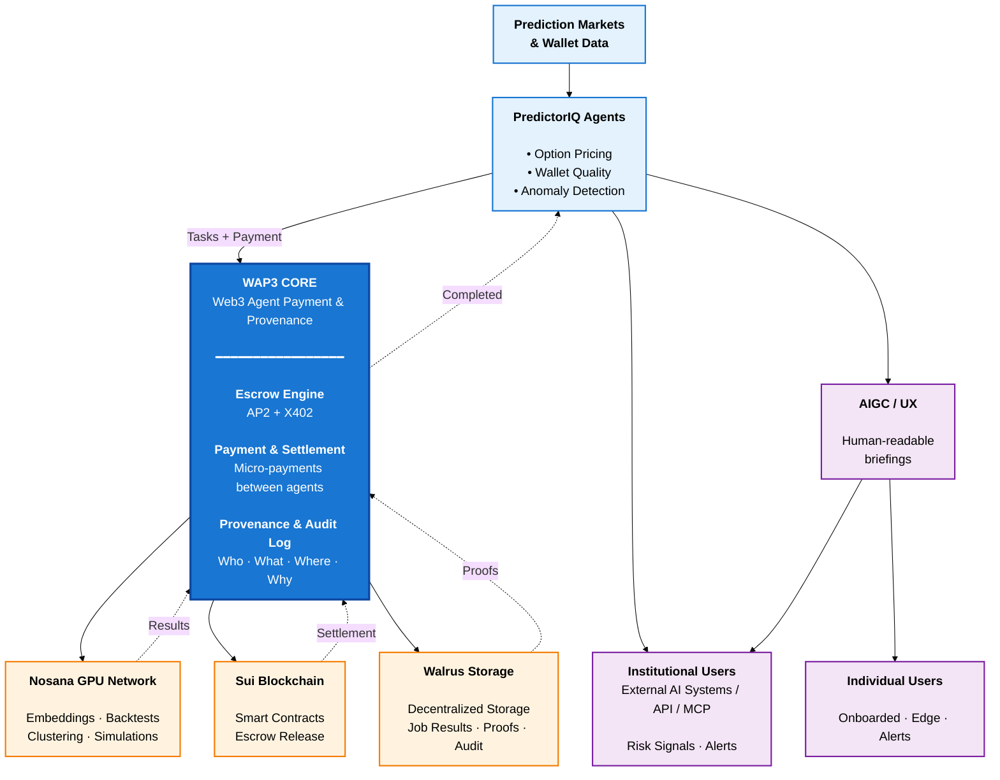

# WAP3 Architecture Overview

Technical companion to product overview. Explains system structure, Nosana integration, and agent interaction patterns.

---

## Architecture Diagram



---

## Component Stack

Three main layers:

### 1. Agents and Products (PredictorIQ)

Long-running agents watching prediction markets and wallets:
- Option pricing and mispricing detection
- Wallet quality and anomaly detection
- Structural anomaly and early alert analysis

Implemented in Python for modeling, TypeScript shim for WAP3 communication.

### 2. WAP3 Core

TypeScript engine handling:
- Accounts and balances
- Escrow and settlement rules
- Execution request routing
- Provenance logging

Agent API:
- Start execution with spec and execution layer
- Check status and results

### 3. Nosana Execution Layer

Module at `execution/nosana`:
- Wraps `@nosana/kit` v2
- Translates specs to Nosana `jobDefinition`
- Submits to Nosana markets
- Monitors job events
- Retrieves IPFS results

Architecture:

```
[PredictorIQ agents] → [WAP3 engine] → [Nosana GPU network]
        ↑                    ↓                   ↓
  users/strategies    accounts/escrow      job results (IPFS)
```

---

## Execution vs Settlement

**Execution**: Running containerized jobs on GPUs (Nosana)
**Settlement**: Locking funds, verifying outcomes, releasing/refunding, recording provenance

### Request Flow

1. **Agent prepares job**
   - Execution layer: "nosana"
   - Container image and command
   - Input payload
   - User/strategy reference

2. **Agent calls WAP3**
   - Account validation
   - Fund check and escrow lock

3. **WAP3 → Nosana handoff**
   - Create Nosana client
   - Convert spec to jobDefinition
   - Submit via `client.api.jobs.create()`
   - Log Nosana job id

### Monitoring and Completion

4. **Monitor Nosana job**
   - Start `client.jobs.monitor()`
   - Filter events by job id
   - Check state transitions
   - Capture `ipfsResult` on completion

5. **Settlement in WAP3**
   - Validate result format
   - Apply settlement rules
   - Update balances
   - Write provenance entry

Separation point:
- Nosana guarantees job execution and IPFS artifact
- WAP3 guarantees conditional fund release and economic trail

---

## PredictorIQ Integration

Built above WAP3, uses it for GPU coordination.

### Option Pricing Agent

1. Observes markets with option-like payoffs
2. Constructs job spec with market ids and pricing parameters
3. Submits via WAP3 with `execution_layer: "nosana"`
4. Receives risk-neutral probabilities and fair value estimates
5. Updates price quality metrics and flags mispricings

### Early Alert Backtest

1. Selects historical window around known event
2. Builds batch job to reconstruct probability structures
3. Submits large job through WAP3 to Nosana
4. Uses results to validate anomaly detection and calibrate thresholds

Agents don't manage GPU provisioning. They submit jobs to WAP3 and pay for verifiable results.

---

## Code Structure

Nosana-related components:

**`execution/nosana/nosana-layer.ts`**:
- Wraps `@nosana/kit` v2
- Accepts execution requests
- Creates and monitors Nosana jobs
- Retrieves IPFS results
- Returns normalized status to WAP3

**`execution/README.md`**:
- Execution layer interface spec
- Provider extension pattern

**`docs/NOSANA_INTEGRATION.md`**:
- Integration details and usage

**`docs/PRODUCT_OVERVIEW.md`**:
- Product rationale and workload descriptions

New execution backends follow same interface as `nosana-layer.ts`. Currently only Nosana is implemented and used.

---

## Compute Verification

Design makes compute usage:

**Easy to ramp**:
- New strategies = more jobs through same pipeline
- No extra integration when volume grows

**Easy to verify**:
- Every execution has Nosana job id
- IPFS result hash recorded
- Settlement record in WAP3

Grant GPU planning:
- M1: 50-100 GPU-hours (validation)
- M2: 2,000-2,500 GPU-hours/month (integration)
- M3: 4,500-5,000 GPU-hours/month (pilot)

Observable through:
- Nosana dashboard and job logs
- WAP3 provenance records
- Custom metrics dashboards

---

## Summary

- **Nosana**: Containers and GPUs
- **WAP3**: Money and audit trail
- **PredictorIQ**: Primary GPU consumer with high-value workloads

Code already implements this separation. Remaining work:
- Harden Nosana execution layer
- Scale workloads
- Ship pilot-ready system
