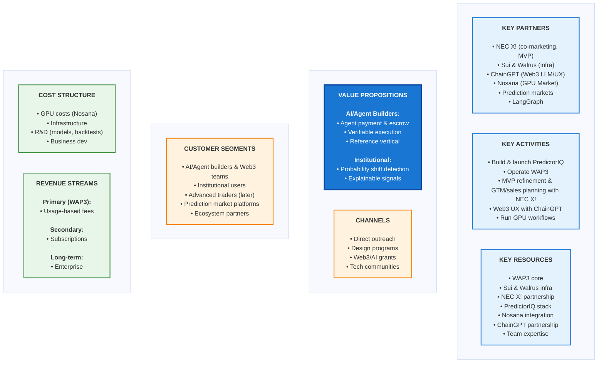

# WAP3 + PredictorIQ – Business Model Canvas

---

This canvas describes the business model for the current WAP3 + PredictorIQ stack, aligned with the internal product and architecture docs.

---

## 1. Problem

- High-impact events (political, macro, systemic, climate) are hard to detect early using traditional signals alone.
- Prediction markets encode collective beliefs, but raw prices are:
  - Noisy (low liquidity, manipulation, shallow flows)
  - Hard to interpret for institutions and AI systems
- Multi-agent systems need:
  - A way to coordinate and pay each other for work (micro-payments)
  - Verifiable execution and provenance
  - Trustable, explainable signals instead of black-box outputs

---

## 2. Customer Segments

Primary segments:

- **AI / Agent system builders and Web3 infra teams**
  - Teams deploying agent-based workflows (LangGraph, tool-using LLMs, internal orchestration)
  - Need agent-native payment, settlement, and audit layers
  - Web3 infrastructure teams building multi-agent systems

- **Institutional users**
  - Funds, trading desks, risk teams
  - Policy / research organizations
  - Infrastructure and operations teams needing early risk signals

- **Advanced individual users / traders** (later, via PredictorIQ frontends)
  - Sophisticated traders seeking market quality insights
  - Users wanting structural anomaly alerts

Secondary segments:

- **Prediction market platforms**
  - Potential integration partners for data and co-marketing

- **Ecosystem partners**
  - GPU networks (Nosana)
  - Corporate innovation programs (e.g., NEC X, accelerators, grants)

---

## 3. Value Propositions

For **AI / Agent system builders** (Web3 first):

- Agent-native payment and programmable escrow
- Verifiable execution and provenance for multi-agent workflows
- A reference vertical (PredictorIQ) that proves the pattern

For **institutional users**:

- Early detection of probability shifts around high-impact events
- Explainable risk signals (price quality + wallet quality)
- Integration into dashboards, models, or internal agents

For **advanced individual users** (later):

- Cleaner views of market quality and wallet quality
- Alerts for structural anomalies

For **ecosystem partners**:

- Steady usage of GPU workloads from market analysis and backtests
- Higher-value use case demonstrating the power of prediction markets beyond speculation

---

## 4. Key Activities

- Maintain **PredictorIQ** (price quality, wallet quality, anomaly detection)
- Operate **WAP3** (escrow, payment, audit / provenance)
- Run **GPU workflows** (backtests, embeddings, simulations)
- Work with **design partners**:
  - Institutional users piloting risk signals
  - Agent framework builders integrating WAP3
- Gradually refine **pricing and packaging**:
  - Usage-based billing
  - Subscription bundles

---

## 5. Key Resources

- WAP3 core implementation:
  - Escrow engine (AP2 + X402)
  - Payment and settlement contracts
  - Audit / provenance pipeline
- PredictorIQ analytics stack:
  - Market data connectors
  - Modeling code for price and wallet quality
  - Backtest and evaluation scripts
- GPU execution backend:
  - Nosana integration (`@nosana/kit` v2 and execution layer)
- Founder and team expertise:
  - Agentic systems, Web3 settlement, prediction markets
  - AIGC pipelines and content provenance

---

## 6. Key Partners

- **Nosana**
  - Primary GPU provider for heavy workloads
  - Co-marketing and co-funding via grants and pilots

- **Prediction market venues**
  - Data access and API integrations
  - Potential joint experiments around risk signaling

- **Accelerators and programs (e.g., NEC X)**
  - Strategic guidance
  - Access to enterprise and public-sector use cases

- **Agent framework maintainers (e.g., LangGraph ecosystems)**
  - Integration into existing orchestration stacks
  - Example: dual-agent demo (Buyer Agent + Service Agent)

---

## 7. Channels

- Direct founder-led outreach to:
  - Funds / risk teams
  - Agent platform builders
- Participation in:
  - Web3 / AI grants and accelerators (NEC X, Nosana program, etc.)
  - Technical communities (prediction markets, LangGraph, agentic AI)
- Content and demos:
  - Public MVP demos (dual-agent demo, risk-signal demo)
  - AIGC-generated briefings as a human-friendly entry point

---

## 8. Revenue Streams

**Web3 / WAP3 usage (primary)**:

1. **Usage-based fees** for agent workloads executed via WAP3
   - Billing tied to WAP3 usage and compute consumption
   - Pass-through of GPU costs plus a margin
   - Applies to any agent workflow using WAP3 (not just PredictorIQ)

**PredictorIQ vertical (secondary)**:

2. **Subscription tiers** for institutional access to PredictorIQ signals
   - Bundled offerings that include:
     - Allocated Nosana compute
     - Market access limits (venues, number of markets)
     - Features (dashboards, APIs, alerting)
     - Support and SLAs

**Longer-term**:

- Enterprise deployments of WAP3 + PredictorIQ as internal systems:
  - Flat or tiered licensing
  - Hybrid on-prem / cloud architectures

---

## 9. Cost Structure

- GPU costs:
  - Nosana GPU-hours for validation, integration, and scaled workloads
  - Backtesting and simulation runs
- Infrastructure and dev ops:
  - Node / RPC costs
  - Storage (IPFS / object storage)
  - Monitoring and logging
- R&D:
  - Model development and calibration
  - Backtest pipelines and evaluation
- Business development:
  - Time spent with design partners and accelerators
  - Minimal marketing, focused on technical content and demos

---

## 10. Key Metrics (early stage)

- Signal quality:
  - Backtest performance of mispricing and risk alerts
  - Correlation between alerts and real-world events
- Adoption:
  - Number of design partners / pilot users
  - Number of agents and workflows running on WAP3
- Economics:
  - GPU usage vs. revenue from paying users
  - Conversion from grant-funded usage to paying subscriptions
