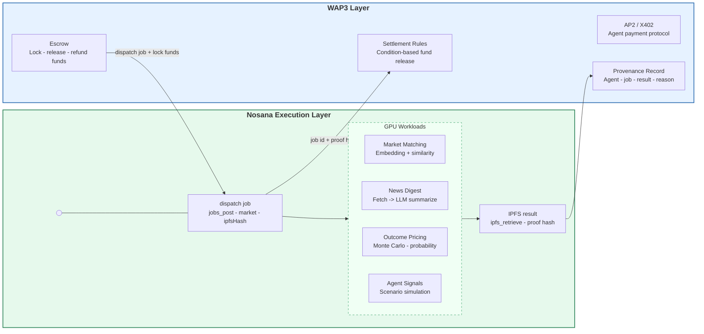
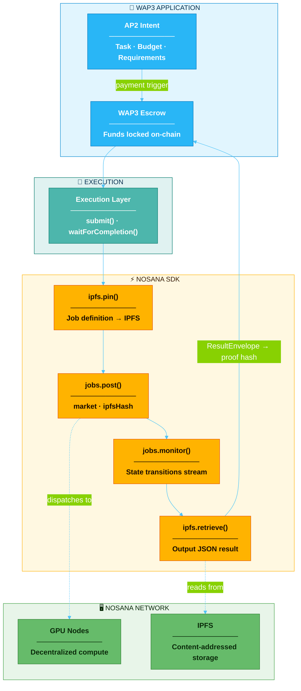
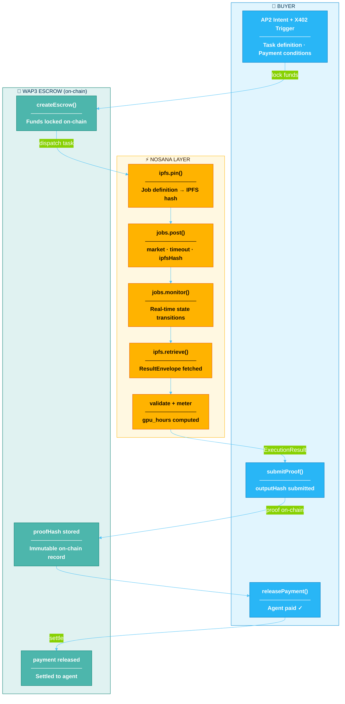

# Nosana Integration — Technical Architecture

## Overview

WAP3 uses **Nosana as the primary and default GPU execution backend** for all AI-intensive workloads in the launch / pilot phase. This document describes the canonical integration flow, execution architecture, and GPU workload catalog powering the **PredictorIQ** reference vertical.

---

## Product Overview



---

## Architecture Layers



---

## Canonical SDK Flow

The integration follows the **official `@nosana/kit` workflow** end-to-end:

### Step 1 — Pin Job Definition to IPFS

```typescript
const { ipfsHash } = await client.ipfs.pin(jobDefinition);
// jobDefinition is a Nosana v0.1 container job spec (see Job Template System below)
```

### Step 2 — Post Job to Market

```typescript
const jobResponse = await client.jobs.post({
  market: this.market,       // Nosana market address
  timeout: 300,              // max execution seconds
  ipfsHash                   // pinned job definition
});
const nosanaJobId = jobResponse.id;
```

### Step 3 — Monitor State Transitions (real-time)

```typescript
const [events, stop] = await client.jobs.monitor();
for await (const event of events) {
  if (event?.data?.id !== nosanaJobId) continue;

  const state = event?.data?.state;
  console.log(`[nosana][trace=${executionId}] state=${state}`);

  if (["done", "completed", "success"].includes(state)) {
    const ipfsResult = event?.data?.ipfsResult;
    // proceed to Step 4
    stop();
    break;
  }
  if (["stopped", "failed", "error"].includes(state)) {
    stop();
    throw new Error(`Job failed: ${state}`);
  }
}
```

### Step 4 — Retrieve Output from IPFS

```typescript
const rawOutput = await client.ipfs.retrieve(ipfsResult);
// rawOutput must conform to ResultEnvelope schema
```

### Client Initialization

```typescript
const { createNosanaClient, NosanaNetwork } = await import("@nosana/kit");
const client = createNosanaClient(NosanaNetwork.MAINNET, {
  api: { apiKey: process.env.NOSANA_API_KEY }
});
```

---

## Job Template System

**File**: `execution/nosana/job-templates.ts`

Each workload template defines: `image`, `cmd`, `env`, `volumes`, and GPU resource requirements.

### Generic Template Structure

```typescript
{
  version: "0.1",
  type: "container",
  meta: {
    trigger: "api",
    system_requirements: { required_vram: 8 }   // GB
  },
  global: { work_dir: "/workspace" },
  ops: [{
    type: "container/run",
    id: "wap3-<taskType>-task",
    args: {
      gpu: true,
      image: "python:3.10-slim",
      cmd: ["python", "-c", "<execution script>"],
      env: {
        TASK_TYPE: "<taskType>",
        INPUTS_JSON: JSON.stringify(inputs)
      },
      volumes: [{ name: "nosana-output", dest: "/nosana/output" }]
    }
  }]
}
```

### GPU Workload Catalog (PredictorIQ)

| Template | Workload | Container Image | Output |
|---|---|---|---|
| `monte_carlo_pricing` | Option-style pricing / Monte Carlo simulation | `python:3.10-slim` + scipy | Risk-neutral probability range, scenario stats |
| `market_embedding` | Market text embedding + similarity clustering | `python:3.10-slim` + sentence-transformers | Embeddings, cluster map, top matches |
| `backtest_replay` | Historical strategy backtest & replay | `python:3.10-slim` + pandas | Metrics, traces, reproducible seed/config |

---

## ResultEnvelope Schema

All job outputs must conform to this envelope (target: `execution/nosana/result-schema.ts`):

```typescript
interface ResultEnvelope {
  ok: boolean;
  task: string;                    // template name
  version: "1.0";
  inputs: Record<string, unknown>;
  result: Record<string, unknown>; // workload-specific output
  diagnostics?: {
    duration_ms: number;
    output_hash: string;           // sha256 of result JSON
  };
}
```

**Output path inside container**: `/nosana/output/result.json`

---

## Execution Record & Metering

Every completed job produces a structured record for audit and billing:

```typescript
interface ExecutionRecord {
  jobId: string;           // Nosana job ID
  market: string;          // Nosana market address
  submittedAt: string;     // ISO timestamp
  startedAt?: string;
  finishedAt?: string;
  state: ExecutionStatus;
  ipfsHash: string;        // pinned job definition
  ipfsResult?: string;     // output IPFS hash
  resourceUsage?: {
    gpu_count: number;     // default: 1 if unknown
    gpu_hours: number;     // (finishedAt - startedAt) / 3600 * gpu_count
  };
  outputHash?: string;     // sha256 of ResultEnvelope
  error?: string;
}
```

**GPU-hours formula:**

```
gpu_hours = (finishedAt_epoch - startedAt_epoch) / 3600 × gpu_count
```

`gpu_count` defaults to `1` when not reported by the node; stored explicitly in the record.

---

## Integration with Escrow



---

## Error Handling & Graceful Degradation

The layer falls back to **mock mode** automatically when:

1. `USE_NOSANA_REAL` is not set to `"true"`
2. `NOSANA_API_KEY` or `NOSANA_MARKET` are missing
3. `@nosana/kit` SDK is not installed
4. API or network errors occur

Mock mode simulates the full `pin → post → monitor → retrieve` cycle locally with configurable delay, enabling zero-dependency development and CI.

### Logging Pattern

```
[nosana][trace=exec_abc123] Pinning job definition to IPFS...
[nosana][trace=exec_abc123] ipfsHash=Qm...
[nosana][trace=exec_abc123] Posting job to market: <address>
[nosana][trace=exec_abc123] nosanaJobId=<id>
[nosana][trace=exec_abc123] Monitoring state transitions...
[nosana][trace=exec_abc123] state=running
[nosana][trace=exec_abc123] state=completed  ipfsResult=Qm...
[nosana][trace=exec_abc123] Retrieved ResultEnvelope, outputHash=sha256:...
[nosana][trace=exec_abc123] gpu_hours=0.0083 (30s × 1 GPU)
```

---

## Configuration

### Environment Variables

| Variable | Required | Description |
|---|---|---|
| `USE_NOSANA_REAL` | No | Set `"true"` to enable real Nosana API (default: mock) |
| `NOSANA_API_KEY` | Real mode | Nosana API authentication key |
| `NOSANA_MARKET` | Real mode | Nosana market address for job submission |

### Quick Start

```bash
# Mock mode (default) — no credentials needed
npm run demo:nosana

# Real Nosana Mainnet
USE_NOSANA_REAL=true \
NOSANA_API_KEY=<your-key> \
NOSANA_MARKET=<market-address> \
npm run demo:nosana-escrow
```

---

## Running Demos

| Command | Description |
|---|---|
| `npm run demo:nosana` | Standalone Nosana execution demo (mock or real) |
| `npm run demo:nosana-escrow` | Full end-to-end: escrow → GPU job → proof → settlement |
| `npm test:nosana` | Automated integration test suite with report output |

Demo output artifacts are written to `demo/out/`.

---

## Performance Characteristics

| Phase | Latency |
|---|---|
| `ipfs.pin()` | ~200–800ms |
| `jobs.post()` | ~100–500ms |
| GPU execution | 10–120s (workload-dependent) |
| `ipfs.retrieve()` | ~1–5s |
| Total round-trip | ~15–130s |

---

## Security

- API keys in environment variables; never committed to version control
- IPFS outputs are content-addressed (immutable); for sensitive data, encrypt before pinning
- `outputHash` (sha256 of `ResultEnvelope`) is submitted on-chain as the proof — binds the settlement to a specific, unalterable result
- `ExecutionRecord` is persisted locally for auditability independent of on-chain state

---

## References

- Nosana SDK: `@nosana/kit` v2.0.38
- Nosana Docs: https://docs.nosana.io
- WAP3 Technical Reference: `TECHNICAL.md`
- Contract ABI: `artifacts/contracts/AgentEscrow.sol/AgentEscrow.json`

---

## Implementation Requirements

> **Purpose**: demonstrate real SDK usage through two concrete GPU-backed workflows, aligned with WAP3 escrow + PredictorIQ as the reference vertical.

---

### Background & Goals

This is a **demo-first integration** targeting Nosana as audience. The objective is to show that WAP3 can use Nosana as its default GPU execution backend in a credible, repeatable way — not a toy example. Two recurring, domain-relevant workflows are required to demonstrate sustainable usage patterns (not one-off jobs).

Key design constraints that must be reflected in all deliverables:

- **Execution / settlement separation**: Nosana owns container execution and IPFS output storage. WAP3 owns escrow, proof submission, and on-chain provenance. Neither layer bleeds into the other.
- **GPU-hours as a first-class metric**: every job must record `startedAt`, `finishedAt`, and `gpu_count` so that `gpu_hours = (finishedAt − startedAt) / 3600 × gpu_count` can be computed and stored in `ExecutionRecord`.
- **Recurring workload pattern**: workflows are triggered per-market on a schedule, not just once. The usage model formula `active_markets × jobs_per_market_per_day × avg_gpu_time_per_job` must be demonstrable.
- **Minimal scope**: only the two workflows below. Option pricing and backtesting are explicitly out of scope for this iteration.

---

### Workflow #1 — Cross-venue Market Matching

**What it does**: given a "seed" prediction market (from any venue), find the top-K semantically equivalent markets across other venues, and determine whether they represent a tradeable equivalent contract.

**Why GPU**: embedding generation and similarity search over a large candidate corpus benefit from GPU acceleration even at small scale; this is the canonical use case for GPU-backed ML inference on Nosana.

#### Inputs

```json
{
  "seed_market": {
    "venue": "polymarket",
    "market_id": "string",
    "title": "string",
    "description": "string",
    "outcomes": ["Yes", "No"],
    "time_window": { "start": "ISO8601", "end": "ISO8601" }
  },
  "candidates": [ /* same shape, from other venues */ ],
  "top_k": 5
}
```

#### Outputs

```json
{
  "matches": [
    {
      "market_id": "string",
      "venue": "string",
      "similarity_score": 0.0,
      "canonical": {
        "outcome_type": "binary | scalar | categorical",
        "threshold": "string | null",
        "expiry": "ISO8601"
      },
      "equivalent": true,
      "reasons": ["string"]
    }
  ]
}
```

#### Implementation checklist

- [ ] New Nosana job template: `market_embedding` in `execution/nosana/job-templates.ts`
- [ ] Python entrypoint: `execution/nosana/jobs/market_matcher/main.py`
  - Canonicalize seed + candidate markets
  - Generate embeddings using a small open model (e.g. `sentence-transformers/all-MiniLM-L6-v2`)
  - Compute cosine similarity, retrieve top-K
  - Apply hard equivalence filters (outcome type match, expiry overlap, threshold compatibility)
  - Write `ResultEnvelope`-conformant JSON to `/nosana/output/result.json`
- [ ] TypeScript glue in `execution/nosana/nosana-layer.ts`: `submitMarketMatchingJob(input)` → returns parsed match results
- [ ] Input/output JSON schema + examples in `docs/specs/nosana-workflows.md`

---

### Workflow #2 — Market News Fetch & Digest

**What it does**: given a seed market, fetch relevant news articles (CPU step, no paid APIs), then use a small open-weight LLM on GPU to produce a structured digest mapping news facts to contract terms.

**Why GPU**: LLM inference for summarization and structured extraction. CPU-only summarization would be too slow for recurring per-market execution; this is the justification for the GPU step.

**Split architecture**: the fetch step runs locally (RSS/search, free sources only); only the summarization/structuring step runs on Nosana. This keeps the Nosana job definition pure (GPU container, fixed inputs) while the orchestration layer handles pre-fetching.

#### Inputs

```json
{
  "market": { /* same seed market shape as Workflow #1 */ },
  "articles": [
    {
      "title": "string",
      "url": "string",
      "source": "string",
      "timestamp": "ISO8601",
      "body": "string"
    }
  ],
  "keywords": ["string"]
}
```

#### Outputs

```json
{
  "clusters": [
    { "cluster_id": 0, "article_ids": [0, 2], "theme": "string" }
  ],
  "digest": {
    "timeline": [ { "date": "ISO8601", "event": "string" } ],
    "key_facts": ["string"],
    "contract_mapping": "how the news maps to contract resolution terms"
  }
}
```

#### Implementation checklist

- [ ] CPU pre-fetch step: `execution/nosana/jobs/news_digest/fetch.ts` — RSS + free search endpoints, no paid APIs; `TODO` markers where an API key would unlock more sources
- [ ] New Nosana job template: `news_digest` in `execution/nosana/job-templates.ts`
- [ ] Python entrypoint: `execution/nosana/jobs/news_digest/main.py`
  - Accepts pre-fetched articles as input (passed via env var or volume)
  - Deduplication + clustering
  - LLM summarization + structured extraction (small open model, e.g. `Qwen/Qwen2.5-1.5B-Instruct`)
  - Write `ResultEnvelope`-conformant JSON to `/nosana/output/result.json`
- [ ] TypeScript orchestration: fetch locally → pass to `submitNewsDigestJob()` → parse results
- [ ] Input/output JSON schema + examples in `docs/specs/nosana-workflows.md`

---

### GPU Usage Model

Every job records:

```
gpu_hours = (finishedAt_epoch − startedAt_epoch) / 3600 × gpu_count
```

Recurring usage scales as:

```
total_daily_gpu_hours = active_markets × jobs_per_market_per_day × avg_gpu_time_per_job
```

Example baseline (conservative):

| Parameter | Value |
|---|---|
| `active_markets` | 50 |
| `jobs_per_market_per_day` | 4 (2× matching + 2× digest) |
| `avg_gpu_time_per_job` | 45s |
| **Daily GPU-hours** | **2.5 h** |

This model must be documented in `docs/specs/gpu-usage-model.md` with the formula, the knobs, and worked examples showing how it scales.

---

### Documentation Deliverables

| File | Status | Notes |
|---|---|---|
| `README.md` | update | Add "Nosana-backed Workflows" section: quickstart commands, how to run both workflows end-to-end, where outputs land |
| `docs/PRODUCT_OVERVIEW.md` | new | Concise product overview: WAP3 core + PredictorIQ as reference vertical; why Nosana; what workloads; sustainable usage narrative |
| `docs/ARCHITECTURE_OVERVIEW.md` | new | Architecture diagram + module descriptions: execution/nosana layer, job templates, result retrieval, settlement hooks, provenance records, monitoring |
| `docs/specs/nosana-workflows.md` | new | JSON schema + examples for both workflow inputs/outputs |
| `docs/specs/gpu-usage-model.md` | new | Usage model formula, knobs, worked examples |

---

### Runability Requirements

All new code paths must be runnable locally:

```bash
# Mock mode (default, no credentials)
npm run demo:nosana

# Real Nosana Mainnet — both workflows
USE_NOSANA_REAL=true \
NOSANA_API_KEY=<key> \
NOSANA_MARKET=<market-address> \
npm run demo:nosana-escrow
```

- Output artifacts: `demo/out/`
- IPFS hashes and `ExecutionRecord` objects logged per job
- `TODO` markers in code wherever secrets or external endpoints are needed
