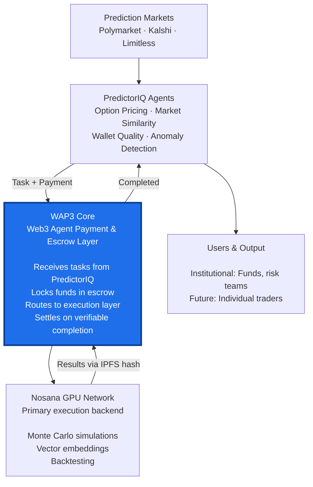

# WAP3 + PredictorIQ Product Overview

## Product Overview Diagram



**Grant & Revenue Notes (potential / in discussion):**
- ~50% of grant → Nosana GPU credits (13k–15k GPU hours over 6 months)
- Post-grant: Usage fees + subscription tiers

---

## Core Concept

WAP3 is an agent-native payment, escrow and provenance layer that coordinates GPU compute on Nosana with deterministic settlement based on verifiable execution results.

Key principles:
- No GPU fleet management
- Nosana as primary execution backend
- Settlement tied to verifiable completion

---

## Nosana Integration

Nosana is the primary GPU provider for agent workloads.

Implementation:
- Execution layer built around `@nosana/kit` v2 SDK
- Job submission to Nosana markets
- Event monitoring for completion tracking
- IPFS result retrieval

While WAP3 is protocol-level compute-agnostic, the actual implementation and all examples target Nosana markets exclusively.

---

## PredictorIQ Reference Product

Intelligence layer for prediction markets built on WAP3.

Connects to:
- Polymarket
- Kalshi
- Limitless

Core functions:
- Option-style pricing and outcome distribution
- Market similarity and clustering
- Wallet quality analysis
- Structural anomaly detection

GPU-intensive workloads include:
- Monte Carlo pricing simulations
- Vector embeddings for market clustering
- Scenario analysis for risk signals

---

## GPU Workload Categories

### Option-Style Pricing

Maps prediction market payoffs to financial options, then:
- Pulls implied volatility data from external option markets
- Runs pricing computations (Black-Scholes, Monte Carlo, grid methods)
- Returns risk-neutral probability ranges
- Quantifies gap versus market-implied probability

Use case: Anchor prediction prices to professional financial markets

### Market Similarity

Embedding and clustering pipeline:
- Embeds market descriptions and news into vectors
- Compares across markets and venues
- Groups markets about the same real-world event

Use case: Cross-venue mispricing detection, risk grouping

### Agent Signals

Scenario simulation and model-based analysis:
- Wallet quality scoring
- Anomaly detection
- Regime-shift analysis

Use case: Trading signals, risk detection, early alerts

---

## Execution vs Settlement

**Nosana (execution layer)**:
- Schedules GPU jobs
- Runs containers to completion
- Writes results to IPFS
- Provides job id, state, metadata

**WAP3 (settlement layer)**:
- Locks funds before job dispatch
- Waits for verifiable completion
- Applies settlement rules
- Records provenance

Separation ensures WAP3 never manages GPUs directly while maintaining economic guarantees.

---

## SDK Usage Pattern

```typescript
// Initialize Nosana client
const client = createNosanaClient(
  NosanaNetwork.MAINNET,
  { api: { apiKey: process.env.NOSANA_API_KEY } }
);

// Submit job
const jobResponse = await client.api.jobs.create({ market, jobDefinition });

// Monitor completion
const [events, stop] = await client.jobs.monitor();
for await (const event of events) {
  // Filter by job id, check state, capture ipfsResult
}

// Retrieve results
const output = await client.ipfs.retrieve(ipfsResult);
```

Settlement flows from execution result back to WAP3 engine for fund release and provenance logging.

---

## Compute Planning

GPU hours over 6-month grant period:

**Months 1-2 (Validation)**:
- 50-100 GPU-hours total
- Focus on SDK integration and flow validation

**Months 3-4 (Integration)**:
- 2,000-2,500 GPU-hours/month
- Always-on workflows: pricing, similarity, backtests

**Months 5-6 (Pilot)**:
- 4,500-5,000 GPU-hours/month
- Scales with pilot users and strategies

Total: ~13,000-15,000 GPU-hours over 6 months

---

## Budget Allocation

From USD 35,000 grant:
- 50% → Nosana compute credits (~$17-18k)
- 50% → Engineering (SDK integration, agent workflows, pilot support)

Goal: Grant funds convert to real on-network GPU usage plus minimal development overhead.

---

## Post-Grant Monetization

Revenue paths:
1. Usage-based fees for agent workloads
2. Subscription tiers for institutional users

Subscriptions bundle:
- Allocated Nosana compute
- Market access limits
- Support and features

Grant covers initial integration and 6 months of GPU usage at scale. After that, paying users fund ongoing Nosana costs.

---

## Summary

- WAP3: Payment, escrow, provenance
- Nosana: GPU execution backend
- PredictorIQ: Reference product consuming GPU at scale
- Integration: `@nosana/kit` v2 wrapped in execution layer
- Plan: Validate loop → Ramp usage → Ship pilot → Monetize
